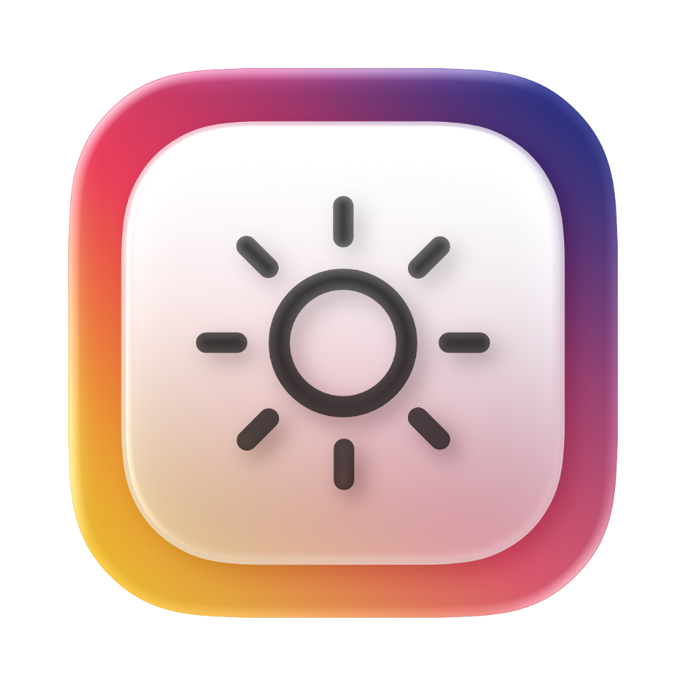

<h3>MonitorControl for macOS 26</h3>

A macOS 26-adapted fork of MonitorControl for controlling external display brightness and volume.
Includes native-style menu sliders, keyboard support, and updated macOS 26 UI behavior.

English | [简体中文](README.zh-CN.md)

> [!IMPORTANT]
> This fork is specifically adapted for macOS 26. If you are not running macOS 26, please use the original MonitorControl project instead: [MonitorControl](https://github.com/MonitorControl/MonitorControl).

> [!NOTE]
> Releases published in this repository are intended for macOS 26 users.

  

 
 

 

